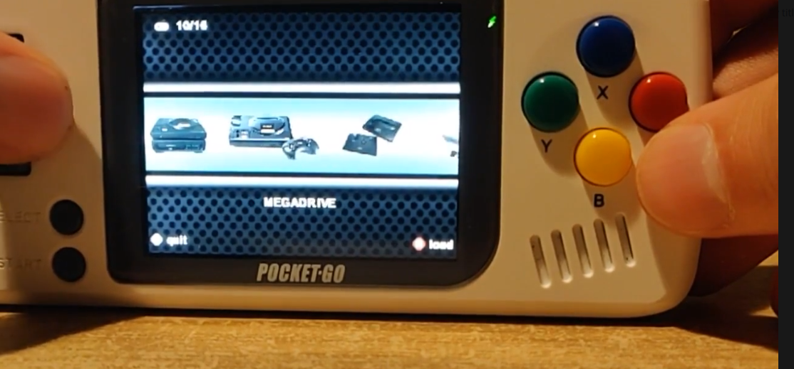
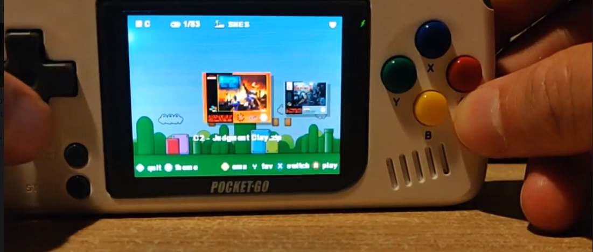
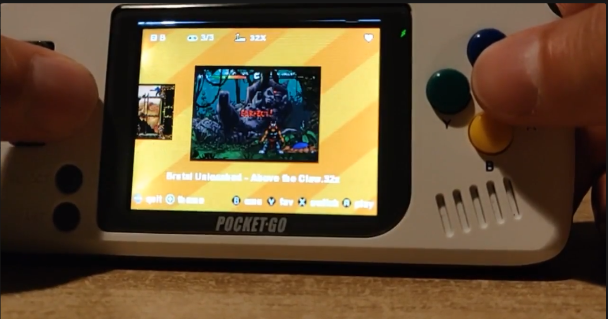

# COVERFLOW V1.0

Coverflow is freeware application build for PocketGo & BitBoy, but can always be ported to other devices that supports the library SDL. The source is available for everyone and can be viewed on github. It’s made for who like to have a fast gui of their game libraries for different emulators. It will view by default boxarts from each game but with one button can be switch to view to screenshot of your games. It’s easy to switch fastly between emulators and many roms without having long loading times. You can even make your own favorite list for each emulator. To get the boxarts and screenshot you have to use a scraper. One of the currently freeware application you can use to do that is: https://www.skraper.net/ but there are others. There are a lot options you can configure such as: creating your own themes, add new emulators and much more that will be explained in this documentation.

Full documentation/installation can be found in our document: https://github.com/peterthrees/Coverflow/blob/master/COVERFLOW.pdf

You can find us on discord: https://discord.gg/Ran4XZ
In the section  [New bitboy/pocketgo] in the channel [Developer-talk] for questions or feedback.

We have made a short demonstration video of the app Coverflow, you can watch this here: https://streamable.com/2vo85

Few Screens:

